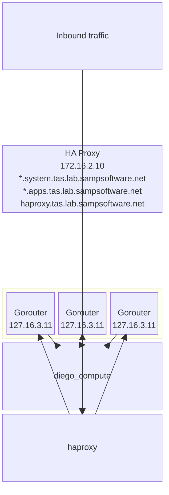

> **⚠️ HISTORICAL — retired.** Documents the TAS 4 / BOSH foundation and its supporting VMs
> (bastion, PiHole, the Nvidia GPU server, MicroCeph) that ran on the old `172.16.0.0/16` lab
> network. **That infrastructure no longer exists.** The lab is now `192.168.20.0/24` (VLAN 20)
> and the Cloud Foundry platform is the Tanzu Platform appliance — see `../../../tpa-homelab`.
> All IPs/names below are historical. Kept for reference only. See `./README.md`.

